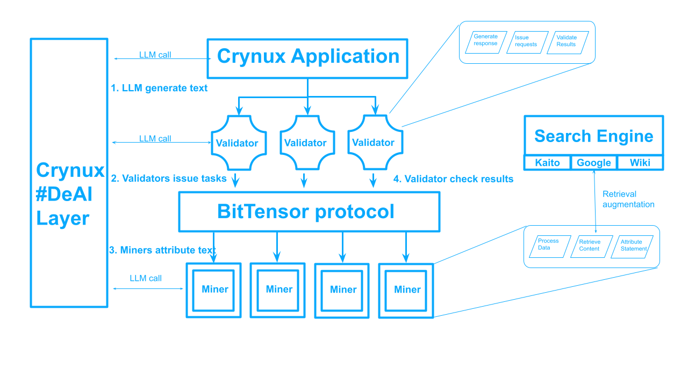

# **Crynux Orbital** <!-- omit in toc -->

 

---

## Decentralized Retrieval Augmented Learning<!-- omit in toc -->

[Discord](https://discord.gg/vJZnq4ujvK) • [Network](https://taostats.io/) • [Research](https://www.researchgate.net/lab/Crynux-AI-Lab-Aaron-Yu)

---
- [Quickstarter](#quickstarter)
- [Introduction](#introduction)
- 
- [Installation](#installation)
  - [Before you proceed](#before-you-proceed)
  - [Install](#install)
- [Writing your own incentive mechanism](#writing-your-own-incentive-mechanism)
- [Writing your own subnet API](#writing-your-own-subnet-api)
- [Subnet Links](#subnet-links)
- [License](#license)

---
## Quickstarter

// TODO
// * Validators: [link](https://crynux.ai)
// * Miners: [link](https://crynux.ai)

---

## Introduction

Crynux means crystallization and nucleation of Decentralized AI (#DeAI),
where the decentralized mechanism mirrors the formation of a crystal.
We aim to build a comprehensive DeAI framework.

Crynux has launched:
* [Hydrogen Network](https://blog.crynux.ai/the-hydrogen-network/): Decentralized inference
* [Helium Network](https://blog.crynux.ai/the-helium-network/): Dynamic task schedule
* Now working on Lithium Network for decentralized finetune.
This is just the beginning.
Crynux is committed to evolving the network continuously, akin to the process of nuclear fusion.

Crynux Orbit is a BitTensor subnet for decentralized retrieval augmented learning.
BitTensor's on-chain consensus engine [Yuma Consensus](https://bittensor.com/documentation/validating/yuma-consensus) is essential to provide incentivie mechanism for DeAI model development, where data, alignment and evaluation are essential to service quality.

Decentralized incentive mechanism provides a more democratic, more trustworthy and higher quality approach for AI model training and evaluation process. 

## Decentralized Retrieval Augmented Learning (DeRAG)

DeRAG is the technology to make Large Language Models (LLM) more factual, more stable and more reliable. LLMs are notorious for their hallucination behavior, which may produce misinformation. DeRAG utilizes decentralized effort to retrieve relavant  information, and attribute to the text generated by LLMs.

### Example

Google made an error when showing their demo of Bard as response to OpenAI's ChatGPT. This error costs $100 billions of its market value. Read the news [here](https://www.cnn.com/2023/02/08/tech/google-ai-bard-demo-error/index.html).

In this demo, a user asked: "What new discoveries from the James Webb Space Telescope can I tell my 9 year old about?"

Bard responded: "JWST took the very first pictures of a planet outside of our own solar system."

However, according to [NASA](https://science.nasa.gov/resource/2m1207-b-first-image-of-an-exoplanet/), "the first image showing an exoplanet was taken by the European Southern Observatory’s Very Large Telescope nearly".

### How do we solve the problem?

The solution is already demonstrated in the example: use DeRAG.

1. LLM generates some text. In the example: "JWST took the very first pictures of a planet outside of our own solar system"
2. Validators issue requests to miners.
3. Miners provide evidence to support or contradict to the statement. In the example, Miners provide information from NASA or other resources that European Southern Observatory took the first exoplanet image.
4. Validators examine the results and set reward weights for Miners. 

### Validator

Powered by Crynux decentralized computing layer, validators issue or forward LLM prompt and output to the network, expect Miners to provide associated refenreces to this LLM prompt.

For each result from Miners, Rewards are evaluted with these aspects:

* Reliability: Miners should provide authentic and reliable results, not fake information.
* Precision: Miners should provide relevant references accuractely, instead of sending random guess.
* Recall: Miners should provide comprehensive references, not miss any important parts.

The reward score will be calculated as:

2* Reliability* (Precision * Recall) / (Precision + Recall)

### Miner

Utilizing Crynux decentralized computing layer, miners respond to validators by providing references supporting or contradict to the statement. More concretely, here are steps from Miners:

1. Preprocess: decontext the text, split text to mulitple statements
2. Generate search queries: for each statement, generate search queries to search
3. Search for results: for each search query, search relevant information from difference sources
4. Filter and score: for each search result, filter out unrelevant information and give a score to the statement.

## Applications

We will build Discord bot that equips with Crynux Orbital in our [discord group](https://discord.gg/vJZnq4ujvK), and provide a mechanism for community members to invovle into this mechanism.

